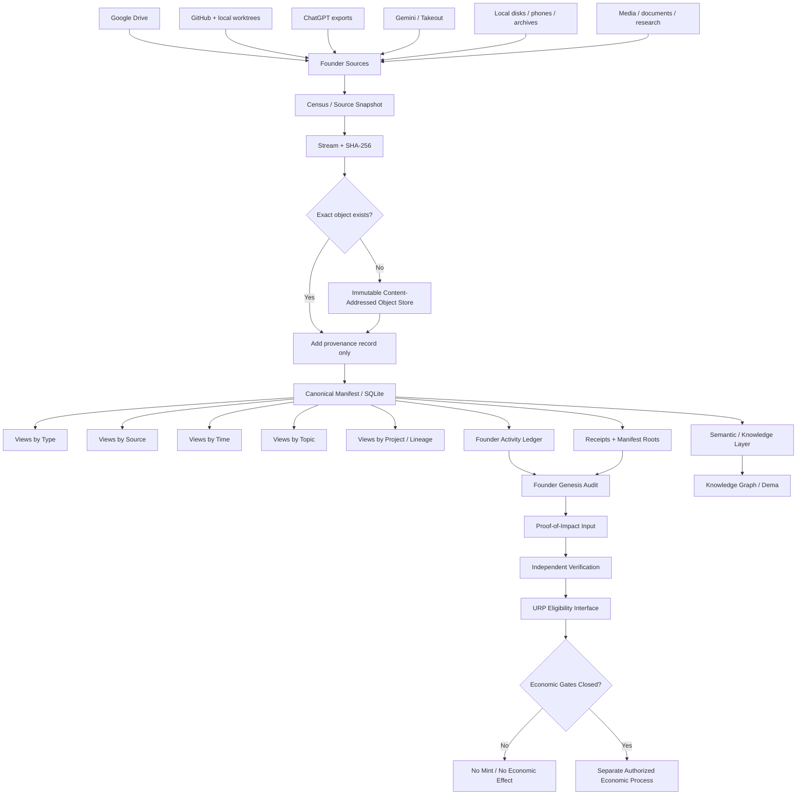
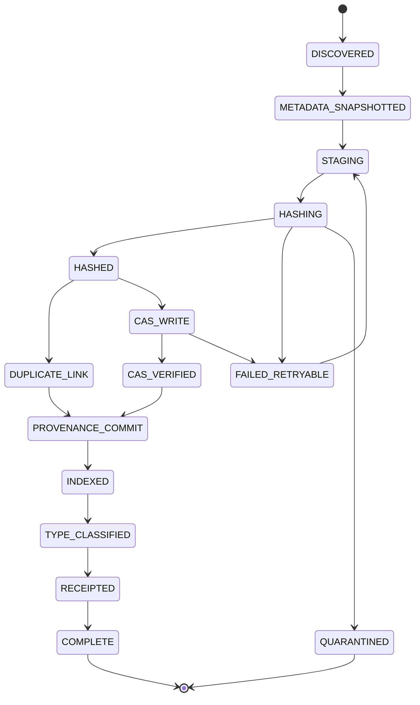
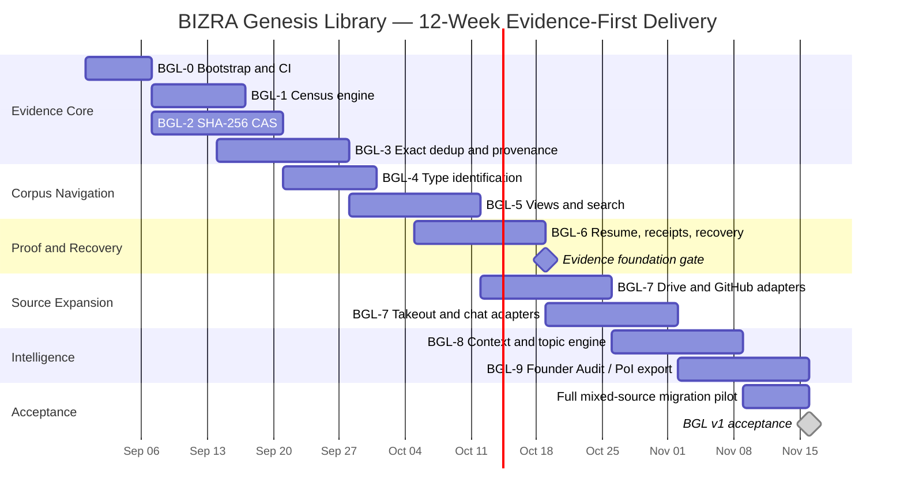

# BIZRA Genesis Library: Master Technical Architecture and Operational Plan

## Executive summary

The **BIZRA Genesis Library (BGL)** should be treated as a foundational evidence system, not as another conventional “data lake.” Its first responsibility is to establish a canonical, reproducible answer to five questions:

> **What does BIZRA possess? Where did each artifact come from? Which artifacts are actually identical? What happened when? What can the evidence legitimately prove?**

Only after those questions are answered should BGL become a semantic knowledge system, Founder Genesis Audit substrate, Proof-of-Impact input, URP resource catalog, Dema memory source, or content-generation engine.

This distinction is especially important for the BIZRA estate. The connected Drive already contains obvious **duplicate candidates**: for example, several copies of `12-27-48-Photographs_of_Epic_Saga.txt` have the same reported byte size, while several separately identified “BIZRA Architecture and Root Analysis” documents coexist with similar sizes. Same size does **not** establish duplicate identity, but it demonstrates why byte-level hashing rather than names or folders must determine exact deduplication. fileciteturn6file2L19-L30 fileciteturn6file3L28-L39 fileciteturn6file4L37-L48 fileciteturn6file1L10-L21 fileciteturn6file7L64-L75

The Drive estate also contains same-sized copies of BIZRA lexicon material under different file IDs, reinforcing that this is a real corpus-management problem rather than a theoretical optimization. fileciteturn8file4L37-L48 fileciteturn8file5L46-L57

Chat history must be a first-class evidence source rather than something flattened immediately into RAG chunks. The Gemini artifact supplied with this research already demonstrates why: it carries platform/source metadata and a complete sequence containing research, architecture discussions, audit reasoning and development decisions. That is provenance-rich historical evidence, not merely text for semantic retrieval. fileciteturn0file0

The proposed BGL architecture is therefore:



The architectural law should be:

> **Higher layers may interpret lower layers; they may never rewrite the historical evidence beneath them.**

That produces five logical planes:

| Plane | Function | Mutation rule |
|---|---|---|
| Evidence | Original bytes, source metadata, source snapshots | Immutable after successful ingest |
| Proof | Hashes, provenance, receipts, manifests, verification | Append/version only |
| Knowledge | Topics, entities, relationships, lineage, semantic search | Recomputable/versioned |
| Audit | Founder activity, contribution, rights, valuation inputs | Evidence-bound and appealable |
| Economic | PoI eligibility and URP interfaces | Separate authority boundary; BGL cannot mint |

This also matches the direction already recorded in BIZRA’s own PoI material: the current BIZRA corpus describes an economic model where founder/VC pre-minting is rejected and economic issuance is intended to depend on verified impact. BGL should treat that as an internal constitutional requirement to be implemented through evidence and independent gates, not as permission to mint based merely on possession of historical files. fileciteturn7file0L2-L2

The recommended technical baseline is:

| Decision | Recommendation |
|---|---|
| Primary storage | Local 4 TB volume initially, with capacity gate before bulk ingest |
| Canonical object identity | SHA-256 |
| Object store | Plain filesystem CAS, `sha256/ab/cd/<digest>` |
| Metadata DB | SQLite on the same local host |
| Runtime | Python 3.12 |
| Fast workers | Optional Rust only after profiling |
| Search | SQLite FTS5 initially |
| Analytics | SQLite first; optional DuckDB read-side later |
| Graph | Derived layer only, not phase-one authority |
| Cloud | Optional encrypted replication/archive, never required for local truth |
| Receipts | Canonical JSON + SHA-256 + chain + optional digital signature |
| Ingest | Read-only, resumable, idempotent |
| Economic authority | Explicitly outside the ingest engine |

Python's standard `hashlib` includes SHA-256 and supports incremental hashing, making it suitable for streaming files far larger than RAM. citeturn3search0 SQLite is appropriate for a single-machine initial BGL, but its database file should stay on the local host rather than a network filesystem when WAL is used; SQLite documents that WAL depends on same-host shared memory and permits only one writer at a time. citeturn14view3

One current implementation warning is important: SQLite disclosed a rare WAL-reset corruption bug affecting versions through 3.51.2 under particular concurrent writer/checkpoint conditions; it is fixed in 3.51.3 and later, with specified backports. A BGL deployment using WAL should therefore verify the actual runtime SQLite version rather than assuming the version bundled with Python or the operating system is safe. citeturn14view4

The 4 TB disk is also not automatically large enough. A marketed 4 TB decimal volume is about **3.64 TiB**. A prudent BGL operating policy would cap steady-state usage around 70–75%, roughly **2.8–3.0 TB**, until actual staging, derived-data, database and recovery requirements are measured. That 70–75% figure is a BGL safety policy, not a storage-industry law. If census predicts more than roughly 3 TB of unique canonical objects, BGL should add capacity before bulk migration rather than filling the only evidence volume to exhaustion.

The project should be executed as **BGL-0 through BGL-9**, with a hard semantic boundary after BGL-6:

```text
BGL-0  Bootstrap
BGL-1  Census
BGL-2  Content addressing
BGL-3  Exact dedup + provenance
BGL-4  Type index
BGL-5  Search + human views
BGL-6  Recovery / idempotency / receipts
        ↓
        EVIDENCE FOUNDATION ACCEPTANCE GATE
        ↓
BGL-7  Cloud/chat/repository adapters
BGL-8  Context/topic/lineage intelligence
BGL-9  Founder Audit + graph + PoI/URP evidence interface
```

The most important policy is simple:

> **Do not let the intelligence layer outrun the evidence layer.**

## Architecture, storage model, and design choices

The correct physical design is a **content-addressed library with a relational manifest**, rather than a directory tree that physically copies every artifact into multiple categories.

A file can be “2024,” “AI,” “Dual Agentic,” “PDF,” “Google Drive,” and “Founder Research” simultaneously. Physically storing it six times defeats deduplication. BGL should store its bytes exactly once and create as many logical views as necessary.

**Recommended physical layout**

```text
BIZRA_GENESIS_LIBRARY/
│
├── 00_SYSTEM/
│   ├── engine/                         # ONLY this subtree is a Git repo
│   ├── config/
│   ├── policies/
│   ├── schemas/
│   ├── migrations/
│   └── VERSION
│
├── 01_INGEST/
│   ├── staging/
│   ├── partial/
│   ├── source_snapshots/
│   └── checkpoints/
│
├── 02_OBJECTS/
│   └── sha256/
│       ├── 00/
│       ├── 01/
│       ├── ...
│       ├── ab/
│       │   └── cd/
│       │       └── abcdef...           # exact canonical bytes
│       └── ff/
│
├── 03_INDEX/
│   ├── bgl.sqlite3
│   ├── snapshots/
│   ├── manifests/
│   ├── manifest_roots/
│   └── search/
│
├── 04_VIEWS/
│   ├── by_type/
│   ├── by_topic/
│   ├── by_time/
│   ├── by_source/
│   ├── by_account/
│   ├── by_project/
│   ├── by_rights/
│   └── by_lineage/
│
├── 05_DERIVED/
│   ├── text/
│   ├── metadata/
│   ├── thumbnails/
│   ├── transcripts/
│   ├── ocr/
│   ├── embeddings/
│   ├── code_symbols/
│   ├── redacted/
│   └── semantic/
│
├── 06_GRAPH/
│   ├── nodes/
│   ├── edges/
│   ├── lineage/
│   └── exports/
│
├── 07_RECEIPTS/
│   ├── ingest/
│   ├── verify/
│   ├── audit/
│   ├── exports/
│   └── anchors/
│
├── 08_QUARANTINE/
│   ├── corrupt/
│   ├── unsupported/
│   ├── suspicious_archives/
│   ├── unresolved_identity/
│   ├── unresolved_versions/
│   └── security_sensitive/
│
├── 09_EXPORTS/
│   ├── audit_packages/
│   ├── research/
│   ├── media/
│   └── poi/
│
└── 10_BACKUP/
    ├── db/
    ├── receipts/
    ├── manifests/
    └── recovery/
```

`04_VIEWS` should initially contain **reference manifests**, not duplicate content. For example:

```json
{
  "bgl_ref": "sha256:4d3b...",
  "view": "by_topic/proof-of-impact",
  "classification_version": "topic-policy-0.3",
  "confidence": 0.96
}
```

Symlinks may optionally make the library more convenient on Linux, but `.bglref` files are more portable and avoid the hazards of assuming Windows/Linux/macOS link semantics are identical.

**Storage option comparison**

| Option | Strength | Weakness | BGL decision |
|---|---|---|---|
| Filesystem CAS | Transparent, inspectable, easy to recover independently of application | Many tiny objects can stress directory traversal | **Primary recommendation** |
| SQLite BLOB store | Transactional object+metadata coupling | Multi-terabyte byte payloads make DB operationally cumbersome | Do not use for canonical bytes |
| Pack/container files | Better small-object density | Recovery and random access become more complex | Optional optimization later |
| Cloud object store | Excellent off-site replication potential | Cost, credentials, network dependence | Secondary replica only initially |
| NAS/network volume | Central capacity | SQLite WAL constraints; larger failure surface | Do not place active SQLite WAL DB there |
| Separate large archive volume | Keeps derived/index load away from source | Additional hardware | Recommended if unique corpus approaches 3 TB |

SQLite's WAL documentation explicitly requires same-host operation for WAL-backed databases, so the active BGL catalog should remain on the Node0/local host even if object replicas later live elsewhere. citeturn14view3

**Database option comparison**

| Database | Best use | BGL assessment |
|---|---|---|
| SQLite | Local authoritative catalog, low operational burden | **Best v1 choice** |
| PostgreSQL | Later multi-host/multi-writer service | Migration target if BGL becomes network service |
| DuckDB | Analytics over large manifests/Parquet | Excellent optional analytical sidecar |
| Dedicated graph DB | Rich graph traversal | Premature as primary authority; derived only |

PostgreSQL uses MVCC and is designed around concurrent multi-user operation, making it a rational later step if BGL evolves from one-machine stewardship into a multi-process or multi-node metadata service. citeturn11search13 DuckDB is attractive for analysis but historically centered its native write model around one process; its current documentation describes its concurrency model and newer remote capabilities separately. That makes it better treated as an analytical sidecar than as the initial BGL transactional authority. citeturn11search0turn11search1

**Hashing decision**

| Method | Role | Authority |
|---|---|---|
| File size | Cheap candidate screening | None |
| Source-provider checksum | Corroborating metadata | Source-specific |
| Quick fingerprint | Optional scheduling optimization | Never dedup authority |
| SHA-256 full stream | Canonical BGL object identity | **Authoritative exact dedup** |
| Semantic fingerprint | Near-duplicate clustering | Advisory only |

BGL should never accept a name, size, modification time, Drive file ID, Git object ID, embedding similarity or perceptual-media hash as proof that two BGL objects are byte-identical. The final exact-duplicate decision is:

\[
\text{exact\_duplicate}(A,B)
\iff
SHA256(A)=SHA256(B)
\]

For an evidence corpus, the cost of hashing the bytes once is justified by the resulting identity boundary.

**Language and worker design**

| Architecture | Benefit | Cost | Recommendation |
|---|---|---|---|
| Pure Python 3.12 | Fast iteration, excellent parsers/APIs, simplest debugging | Hash/copy hotspots may eventually emerge | **Start here** |
| Python + multiprocessing | Easy parallel extraction/hashing | IPC and DB-write coordination | Use bounded workers |
| Python + Rust binary workers | Excellent throughput and predictable memory | More build/deployment complexity | Add after profiling |
| All Rust | Strong systems performance | Slower adapter/prototype velocity | Not necessary for BGL v1 |

The critical worker pattern is not “maximum parallelism.” It is:

```text
N read/download/hash workers
            │
            ▼
bounded result queue
            │
            ▼
ONE metadata writer / transaction coordinator
            │
            ▼
SQLite
```

That architecture respects SQLite's one-writer reality while still allowing parallel downloads, hashing and extraction. citeturn14view3

## Canonical corpus, provenance, schemas, and deduplication

BGL must distinguish **object identity**, **source occurrence**, **representation**, **version**, **classification**, and **interpretation**. Collapsing those concepts is one of the easiest ways to destroy historical provenance.

The core model should be:

```text
OBJECT
    exact bytes identified by SHA-256
       │
       ├── SOURCE OCCURRENCE A
       ├── SOURCE OCCURRENCE B
       └── SOURCE OCCURRENCE C

SOURCE ENTITY
    provider-level object such as Drive fileId,
    Git repository, ChatGPT conversation,
    Gemini conversation, local inode/path
       │
       └── may have multiple versions/representations

DERIVATIVE
    OCR / extraction / thumbnail / embedding /
    summary / translation / topic assignment
       │
       └── always points to original object
```

This is particularly important for Google Workspace documents. Drive exposes Google Docs/Sheets/Slides by provider identity and can export them to selected MIME types; the ordinary `files.export` API has a 10 MB export-response limit. BGL should therefore treat a Google Doc's `fileId` and, when available, revision information as the provider entity, while its PDF/text/DOCX exports are **representations**, not the original native bytes. citeturn12search1turn12search2

Drive provides revision APIs, but historical revision information should be treated as best-effort corroboration rather than assumed to be a perfect eternal ledger; BGL should preserve whatever revision metadata and revision exports the provider makes available at acquisition time. citeturn0search4turn0search12

**Core relational schema**

A practical SQLite v1 schema can begin with these tables:

| Table | Purpose | Important fields |
|---|---|---|
| `objects` | Unique byte objects | `sha256`, size, MIME, first_seen, storage_path |
| `source_accounts` | Six founder accounts and other identities | alias, provider, consent state |
| `source_entities` | Provider-level records | provider ID, account, type, raw metadata |
| `source_occurrences` | Where an object was observed | path, source timestamp fields, acquired_at |
| `representations` | Exports/derivatives of a source entity | source entity, object, representation type |
| `relationships` | Duplicate/version/derived/member links | subject, predicate, object, confidence |
| `classifications` | Topic/type/project labels | classifier version, confidence, reviewer |
| `ingest_runs` | Pipeline execution | run ID, source, status, checkpoints |
| `receipts` | Tamper-evident run records | body hash, previous receipt, signature |
| `actors` | Humans/agents/services | founder, engine, verifier |
| `activity_events` | Timestamped work witnesses | actor, source, timestamp, event type |
| `activity_sessions` | Derived session groupings | policy, start/end, estimates |
| `contributions` | Candidate PoI contribution units | provenance, rights, status |
| `verification_runs` | Independent verification | verifier, inputs, outcome |
| `consent_grants` | Account/data/economic permissions | scope, subject, granted/revoked |
| `claims` | Explicit historical/economic claims | claim, evidence state, confidence |

A representative SQL core:

```sql
CREATE TABLE objects (
    sha256 TEXT PRIMARY KEY
        CHECK(length(sha256) = 64),
    byte_size INTEGER NOT NULL CHECK(byte_size >= 0),
    media_type TEXT,
    extension TEXT,
    storage_relpath TEXT NOT NULL UNIQUE,
    first_ingested_at TEXT NOT NULL,
    integrity_state TEXT NOT NULL
        CHECK(integrity_state IN (
            'VERIFIED', 'QUARANTINED', 'CORRUPT'
        ))
);

CREATE TABLE source_accounts (
    account_id TEXT PRIMARY KEY,
    provider TEXT NOT NULL,
    account_alias TEXT NOT NULL UNIQUE,
    owner_actor_id TEXT,
    consent_state TEXT NOT NULL,
    created_at TEXT NOT NULL
);

CREATE TABLE source_entities (
    source_entity_id TEXT PRIMARY KEY,
    provider TEXT NOT NULL,
    account_id TEXT NOT NULL,
    provider_object_id TEXT,
    entity_type TEXT NOT NULL,
    source_name TEXT,
    raw_metadata_json TEXT NOT NULL,
    FOREIGN KEY(account_id) REFERENCES source_accounts(account_id)
);

CREATE TABLE source_occurrences (
    occurrence_id TEXT PRIMARY KEY,
    source_entity_id TEXT NOT NULL,
    object_sha256 TEXT,
    original_path TEXT,
    source_created_at TEXT,
    source_modified_at TEXT,
    timestamp_kind TEXT,
    timestamp_confidence TEXT,
    observed_at TEXT NOT NULL,
    acquired_at TEXT NOT NULL,
    raw_metadata_sha256 TEXT NOT NULL,
    FOREIGN KEY(source_entity_id)
        REFERENCES source_entities(source_entity_id),
    FOREIGN KEY(object_sha256)
        REFERENCES objects(sha256)
);

CREATE INDEX idx_occurrences_object
ON source_occurrences(object_sha256);

CREATE INDEX idx_occurrences_modified
ON source_occurrences(source_modified_at);

CREATE TABLE relationships (
    relationship_id TEXT PRIMARY KEY,
    subject_id TEXT NOT NULL,
    predicate TEXT NOT NULL,
    object_id TEXT NOT NULL,
    confidence REAL,
    method TEXT NOT NULL,
    policy_version TEXT NOT NULL,
    created_at TEXT NOT NULL
);

CREATE TABLE classifications (
    classification_id TEXT PRIMARY KEY,
    object_sha256 TEXT NOT NULL,
    dimension TEXT NOT NULL,
    label TEXT NOT NULL,
    confidence REAL,
    classifier_id TEXT NOT NULL,
    classifier_version TEXT NOT NULL,
    reviewed_by TEXT,
    created_at TEXT NOT NULL,
    FOREIGN KEY(object_sha256) REFERENCES objects(sha256)
);
```

The original provider metadata should always be retained as raw JSON in addition to normalized fields. Normalization is convenient; the raw provider record protects against future schema misunderstandings.

**Canonical object identity**

```json
{
  "$schema": "https://bizra.example/schemas/bgl-object-v1.json",
  "schema_version": "bgl.object/v1",
  "object_id": "sha256:8e2d5b3b...",
  "sha256": "8e2d5b3b...",
  "byte_size": 145496,
  "media_type": "text/plain",
  "storage": {
    "backend": "local-cas",
    "relative_path": "sha256/8e/2d/8e2d5b3b..."
  },
  "integrity": {
    "full_hash_verified": true,
    "original_bytes_modified": false
  },
  "first_ingest": {
    "run_id": "run_01J...",
    "acquired_at": "2026-08-29T09:14:22Z"
  },
  "source_occurrence_count": 3
}
```

This object record deliberately does **not** say that the object is founder-authored, BIZRA-native, economically valuable, or historically important. Those are downstream claims requiring separate evidence.

**Provenance record**

```json
{
  "schema_version": "bgl.provenance/v1",
  "occurrence_id": "occ_01J...",
  "object_id": "sha256:8e2d5b3b...",
  "source": {
    "provider": "google_drive",
    "account_alias": "google_personal_01",
    "provider_object_id": "1vPJ49D...",
    "original_path": "/Research/..."
  },
  "timestamps": {
    "provider_created_at": "2025-11-07T22:23:45.731Z",
    "provider_modified_at": "2025-11-07T22:23:45.738Z",
    "bgl_observed_at": "2026-08-29T09:10:00Z",
    "bgl_acquired_at": "2026-08-29T09:14:22Z"
  },
  "metadata": {
    "provider_media_type": "text/plain",
    "provider_reported_size": 145496,
    "raw_metadata_object": "sha256:71c..."
  }
}
```

BGL should never overwrite `provider_created_at` because later evidence suggests an older date. Instead it adds another timestamp with another provenance class:

```text
provider_created_at
provider_modified_at
embedded_document_date
archive_member_timestamp
chat_message_timestamp
git_author_timestamp
git_committer_timestamp
filesystem_mtime
BGL_observed_at
BGL_acquired_at
```

That preserves contradictions rather than resolving them prematurely.

**Deduplication law**

| Situation | Treatment |
|---|---|
| Same SHA-256 | One canonical object, multiple provenance occurrences |
| Same provider ID, new revision, different SHA-256 | Separate object + `VERSION_OF` |
| Same name and size | Candidate only; full hash required |
| 99% text similarity | Keep both; `NEAR_DUPLICATE` relation |
| Same image resized/compressed | Keep both; perceptual relation only |
| Same document exported PDF vs DOCX | Keep both as representations |
| Same conversation in HTML and JSON | Keep both; common source entity |
| Git repo copied into multiple folders | Byte/object-level dedup where applicable; preserve repository occurrence |
| Archive plus extracted members | Preserve archive and members; `MEMBER_OF` links |
| External repo fork vs BIZRA-modified fork | Never collapse by semantic similarity |
| Empty files | SHA-256 identifies exact empty content; source occurrences remain distinct |

The connected Drive examples illustrate why the distinction between **candidate duplicate** and **exact duplicate** is essential: same-sized files exist under separate IDs and names, but they should not be collapsed until BGL has read and hashed the actual bytes. fileciteturn6file2L19-L30 fileciteturn6file3L28-L39

Near-duplicate detection should be deferred until exact dedup is proven. Later methods may include normalized-text fingerprints, MinHash, perceptual hashes for imagery, audio fingerprints and AST/code similarity, but **none may automatically delete an object**.

The policy should be:

```text
EXACT DUPLICATE
    deterministic
    SHA-256 equality
    safe to store bytes once

NEAR DUPLICATE
    probabilistic
    advisory relation
    both originals preserved

VERSION
    historical relationship
    both originals preserved
```

## Source adapters, ingestion pipeline, state machine, and CLI

All adapters should obey one generic read-only contract so the core ingest engine does not need provider-specific assumptions.

**Adapter interface**

```python
from __future__ import annotations

from dataclasses import dataclass
from typing import BinaryIO, Iterable, Mapping, Protocol


@dataclass(frozen=True)
class SourceItem:
    provider_id: str
    logical_path: str | None
    item_type: str
    metadata: Mapping[str, object]


@dataclass(frozen=True)
class AdapterCapabilities:
    supports_incremental: bool
    supports_versions: bool
    supports_raw_stream: bool
    supports_deletions_feed: bool


class SourceAdapter(Protocol):
    def capabilities(self) -> AdapterCapabilities: ...

    def discover(
        self,
        cursor: str | None
    ) -> Iterable[SourceItem]: ...

    def metadata(
        self,
        item: SourceItem
    ) -> Mapping[str, object]: ...

    def open_stream(
        self,
        item: SourceItem
    ) -> BinaryIO: ...

    def checkpoint(self) -> str | None: ...
```

A source adapter may additionally expose `list_versions()`, `export_representation()`, or `snapshot_metadata()`, but the core engine should never depend on those optional capabilities.

**Google Drive adapter.** Initial census should use `files.list` with explicit requested fields, pagination and a stored cursor/checkpoint. Drive's official API supports file listing, queries, pagination and corpus selection; for large collections Google recommends care with sorting and corpus scope rather than naïvely treating one huge request as the archive. citeturn12search7

After the initial snapshot, BGL should retain Drive's `changes.getStartPageToken` / `changes.list` cursor so later ingest can process incremental account changes rather than recrawling everything. Google's change feed is chronological and supplies a new start token for subsequent polling. citeturn12search0

For each Drive object preserve at least:

```text
account_alias
fileId
name
mimeType
parents
createdTime
modifiedTime
trashed
size when supplied
source checksum fields when supplied
owners/shared-drive context where authorized
web/source identifiers
raw metadata JSON
BGL observed timestamp
```

Workspace-native documents need separate representation handling. BGL stores the Drive entity, then exports one or more useful representations—for example plain text plus PDF—while making explicit that these are exports. Google's `files.export` endpoint returns Workspace content in a chosen MIME type and imposes a 10 MB response limit, so adapters need a failure state rather than silently pretending a failed export is complete. citeturn12search2

Drive OAuth should use the narrowest practical read scope for the actual archive job, with each founder account represented separately. Google classifies broad Drive read scopes as sensitive/restricted in relevant contexts, so BGL should never embed long-lived OAuth credentials in corpus files or Git. citeturn13view7

**GitHub adapter.** Remote repository history and GitHub platform metadata are two different evidence surfaces.

For Git itself:

```bash
git clone --mirror https://github.com/BizraInfo/REPO.git REPO.git
```

A Git mirror maps all source refs, including remote-tracking branches and notes, rather than merely checking out the default branch. citeturn14view0

Each mirror should then be treated as a source snapshot and optionally converted into an archival bundle after update/verification. GitHub-specific objects—issues, PRs, review comments, workflow runs, releases and other platform metadata—must be collected separately through GitHub REST/GraphQL because they are not ordinary Git objects.

GitHub describes GraphQL as allowing callers to select precisely the fields they need, while `gh api` can call either REST or GraphQL and supports pagination, including cursor-based GraphQL queries using `pageInfo`. citeturn9search1turn9search0

A good split is:

```text
Git transport
    repositories, refs, commits, trees, blobs

GitHub API
    repository metadata
    issues
    pull requests
    reviews/comments
    releases
    workflow metadata
    rules / branch metadata where accessible
```

Local developer repositories require an additional adapter because remote GitHub cannot prove uncommitted work, local worktrees or arbitrary local files. BGL should preserve read-only observations such as:

```text
git status --porcelain=v2
git worktree list --porcelain
git branch -vv
git stash list
git for-each-ref
git log --all ...
```

and separately ingest dirty/untracked files through the local-filesystem adapter. Never run `git clean`, `reset`, `checkout`, `stash pop`, branch deletion or other mutating operations during evidence acquisition.

The pager problem already encountered in the BIZRA tree script should be prevented globally **inside BGL inspection subprocesses**, not by depending on an operator pressing `q`. Git documents the global `--no-pager` option, and GitHub CLI also honors pager environment configuration. citeturn5search0turn5search5

Recommended shell wrapper:

```bash
#!/usr/bin/env bash
set -euo pipefail

export GIT_PAGER=cat
export GH_PAGER=cat
export PAGER=cat

g() {
    command git --no-pager "$@"
}

g status --short --branch
g branch -vv
g stash list
g worktree list --porcelain
g log --graph --decorate --oneline --all --date-order -n 200
```

PowerShell:

```powershell
$env:GIT_PAGER = "cat"
$env:GH_PAGER  = "cat"
$env:PAGER     = "cat"

git --no-pager status --short --branch
git --no-pager branch -vv
git --no-pager log --graph --decorate --oneline --all -n 200
```

**Google Takeout adapter.** Takeout archives themselves must first be canonical evidence objects.

```text
Takeout ZIP/TGZ
      ↓
SHA-256 and preserve untouched
      ↓
safe extraction into staging
      ↓
hash each archive member
      ↓
create MEMBER_OF relationships
      ↓
interpret product-specific sidecars
```

Google warns that a Takeout archive may omit changes occurring between the export request and archive creation. BGL should therefore record the archive/export timestamp separately and never represent a Takeout package as an instantaneous complete snapshot without that caveat. citeturn13view3

Takeout can split large exports into multiple archives. Google also notes that downloaded media may receive new filesystem timestamps while original media metadata remains embedded, and additional metadata may be delivered through secondary JSON files. Those facts make filename/mtime-only chronology unacceptable for BGL media ingestion. citeturn13view3

Safe archive extraction must also reject:

```text
../../path traversal
absolute paths
device names
symlink escape
archive bombs / unreasonable expansion ratios
malformed member names
duplicate-path ambiguity
```

A malicious or corrupt archive is preserved as evidence but its members remain quarantined until safe extraction succeeds.

**ChatGPT adapter.** OpenAI currently provides data export through ChatGPT settings or its Privacy Portal, and the resulting ZIP contains chat history plus other account data. citeturn13view0 OpenAI's current documentation explicitly identifies `conversations.json`; larger exports may contain numbered conversation JSON files. citeturn13view1

Therefore the adapter should not hard-code a single eternal schema. It should:

```text
1. Hash and preserve the ZIP.
2. Hash every extracted member.
3. Detect export format/version structurally.
4. Preserve raw JSON.
5. Parse conversations into normalized entities/messages.
6. Preserve unknown fields.
7. Never overwrite raw provider timestamps.
8. Record parser version.
```

Normalized conversation structure:

```text
conversation
├── provider
├── account_alias
├── provider_conversation_id
├── title
├── created_at
├── updated_at
├── messages[]
│   ├── provider_message_id
│   ├── role
│   ├── timestamp
│   ├── content references
│   ├── attachments
│   └── raw JSON object
└── source export object
```

**Gemini adapter.** Google's current Gemini export instructions direct users through Google Takeout and state that Gemini Apps data can include Gemini chats, generated media and uploads. citeturn15search9 Google's current privacy documentation also describes chat content, shared files/media and generated outputs as data associated with Gemini Apps, depending on settings. citeturn15search2turn15search3

That makes Gemini especially valuable for BIZRA because the evidence corpus is not only conversation text: uploaded files, generated media, instructions and related artifacts may have independent provenance.

**Pipeline state machine**



No pipeline run gets to `COMPLETE` merely because the copy operation exited without an exception. Completion means the destination was re-read or otherwise verified against its intended SHA-256, metadata was committed, and a receipt was emitted.

**Proposed BGL CLI**

```bash
# Initialize
bgl init --root /mnt/bgl

# Register founder identities without exposing raw email in views
bgl account add \
  --provider google \
  --alias founder_google_01

bgl account add \
  --provider openai \
  --alias founder_chatgpt_01

# Read-only census
bgl census filesystem \
  --source /data/old_disk \
  --account local_workstation_01

bgl census drive \
  --account founder_google_01

# Controlled ingest
bgl ingest filesystem \
  --source /data/BIZRA_PILOT \
  --root /mnt/bgl

bgl ingest drive \
  --account founder_google_01 \
  --resume

bgl ingest github \
  --owner BizraInfo \
  --mirror \
  --include-platform-metadata

bgl ingest takeout \
  --source /archives/takeout-001.zip

bgl ingest chatgpt \
  --source /exports/chatgpt-account-01.zip \
  --account founder_chatgpt_01

bgl ingest gemini \
  --source /exports/google-takeout-account-01.zip \
  --account founder_google_01

# Verification
bgl verify objects
bgl verify provenance
bgl verify manifest
bgl verify receipts

# Corpus status
bgl status
bgl stats --by type
bgl stats --by source
bgl duplicates exact
bgl duplicates candidates

# Human views
bgl view rebuild type
bgl view rebuild time
bgl view rebuild source

# Later, not phase one
bgl classify topics --policy topic-v1
bgl activity build --actor founder --profile conservative-v1
bgl audit founder build
bgl poi export --eligible-only
```

## Founder Genesis Audit, activity ledger, receipts, and PoI/URP governance

BGL can eventually reconstruct the founder's three-year activity, but the system must be extremely disciplined about the difference between **timestamped evidence** and **hours worked**.

A conversation timestamp proves activity at a point in time. It does not by itself prove uninterrupted work between that timestamp and the next one.

Therefore:

\[
\text{first event at 09:00}
+
\text{next event at 14:00}
\not\Rightarrow
5\text{ verified labor hours}
\]

The Founder Genesis Audit should expose multiple measurements rather than one flattering number.

**Founder Activity Ledger schema**

```sql
CREATE TABLE actors (
    actor_id TEXT PRIMARY KEY,
    actor_type TEXT NOT NULL,
    display_alias TEXT NOT NULL
);

CREATE TABLE account_identities (
    identity_id TEXT PRIMARY KEY,
    actor_id TEXT NOT NULL,
    provider TEXT NOT NULL,
    account_alias TEXT NOT NULL,
    verification_state TEXT NOT NULL,
    FOREIGN KEY(actor_id) REFERENCES actors(actor_id)
);

CREATE TABLE activity_events (
    event_id TEXT PRIMARY KEY,
    actor_id TEXT NOT NULL,
    identity_id TEXT,
    source_entity_id TEXT,
    object_sha256 TEXT,
    event_time TEXT NOT NULL,
    event_time_kind TEXT NOT NULL,
    event_type TEXT NOT NULL,
    project_context TEXT,
    activity_strength TEXT NOT NULL,
    evidence_confidence REAL NOT NULL,
    raw_evidence_ref TEXT NOT NULL,
    FOREIGN KEY(actor_id) REFERENCES actors(actor_id)
);

CREATE INDEX idx_activity_actor_time
ON activity_events(actor_id, event_time);

CREATE TABLE activity_episodes (
    episode_id TEXT PRIMARY KEY,
    actor_id TEXT NOT NULL,
    canonical_event_time TEXT NOT NULL,
    witness_count INTEGER NOT NULL,
    cross_source_confidence REAL NOT NULL
);

CREATE TABLE activity_sessions (
    session_id TEXT PRIMARY KEY,
    actor_id TEXT NOT NULL,
    policy_version TEXT NOT NULL,
    started_at TEXT NOT NULL,
    ended_at TEXT NOT NULL,
    observed_span_seconds INTEGER NOT NULL,
    estimated_active_seconds INTEGER,
    estimation_class TEXT NOT NULL,
    confidence REAL NOT NULL
);

CREATE TABLE contributions (
    contribution_id TEXT PRIMARY KEY,
    actor_id TEXT NOT NULL,
    title TEXT NOT NULL,
    contribution_class TEXT NOT NULL,
    native_status TEXT NOT NULL,
    rights_status TEXT NOT NULL,
    verification_state TEXT NOT NULL,
    impact_state TEXT NOT NULL,
    replay_key TEXT UNIQUE
);
```

All six founder accounts should map to one actor only **after identity resolution**:

```text
FOUNDER_ACTOR
    ├── ChatGPT personal account 1
    ├── ChatGPT personal account 2
    ├── BIZRA-domain account 1
    ├── BIZRA-domain account 2
    ├── Google/Gemini account
    └── other confirmed founder identity
```

Account linkage itself is a claim and should have evidence/consent.

**Activity event weighting**

Not every timestamp represents founder labor equally:

| Evidence event | Activity interpretation |
|---|---|
| Founder sends prompt | Strong direct activity witness |
| Founder edits document | Strong direct witness |
| Founder Git commit | Strong creation/integration witness |
| Founder-created media job | Strong activity witness |
| File modified by tool automatically | Weak until attribution known |
| Model response timestamp | Does not independently prove founder activity |
| Scheduled CI completion | Machine activity, not founder labor |
| Cloud sync timestamp | Provenance event, not labor |
| Duplicate upload | Source witness, not duplicate work |
| Automated background agent run | System contribution unless founder involvement separately evidenced |

**Sessionization algorithm**

BGL should version the algorithm as policy rather than pretending it discovers metaphysical truth:

```python
def build_sessions(events, policy):
    events = resolve_same_actor(events)
    episodes = collapse_cross_source_witnesses(events)
    episodes.sort(key=lambda e: e.timestamp)

    sessions = []
    current = []

    for event in episodes:
        if not current:
            current = [event]
            continue

        previous = current[-1]
        gap = event.timestamp - previous.timestamp

        continuous_context = (
            event.project_context == previous.project_context
            or has_bridging_evidence(previous, event)
        )

        if (
            gap <= policy.base_session_gap
            or (
                continuous_context
                and gap <= policy.max_bridge_gap
            )
        ):
            current.append(event)
        else:
            sessions.append(score_session(current, policy))
            current = [event]

    if current:
        sessions.append(score_session(current, policy))

    return sessions
```

The report should expose at least:

```text
calendar span
evidence-active days
evidence-active weeks
number of direct founder events
number of sessions
session-span hours
conservative activity estimate
standard sensitivity estimate
cross-source witness count
days with independent multi-source corroboration
```

The **conservative activity estimate** should use bounded gaps, not entire session spans. A policy might start with:

```yaml
activity_policy: conservative-v1

base_session_gap_minutes: 15
max_bridge_gap_minutes: 30

count_assistant_only_events: false
count_ci_only_events: false
count_cloud_sync_as_labor: false

merge_overlapping_accounts: true
collapse_duplicate_witnesses: true
```

A second policy could test 30-minute intervals. The important result is not whether one policy gives 11,000 versus 15,000 hours; it is whether the range, parameters and evidence are explicit.

For economic use, BGL should publish:

```text
MEASURED:
    event counts
    active days
    timestamps
    session boundaries under policy X

DERIVED:
    active-time estimate under policy X

NOT PROVEN DIRECTLY:
    every minute between sparse events was labor
```

That makes the result auditable.

**Founder Genesis Audit contribution pipeline**

```text
RAW ARTIFACT
      ↓
EXACT IDENTITY
      ↓
SOURCE PROVENANCE
      ↓
FOUNDER ATTRIBUTION
      ↓
RIGHTS / LICENSE CLASSIFICATION
      ↓
CONTRIBUTION CLASS
      ↓
DUPLICATE / REPLAY COLLAPSE
      ↓
IMPLEMENTATION EVIDENCE
      ↓
INDEPENDENT VERIFICATION
      ↓
IMPACT EVIDENCE
      ↓
PoI ELIGIBILITY
      ↓
URP POLICY
      ↓
SEPARATE ECONOMIC AUTHORIZATION
```

The distinction between rights classes is essential:

```text
EXTERNAL_REFERENCE
    paper, book, downloaded repo, community material

EXTERNAL_ADAPTED
    outside source materially transformed/integrated

AI_GENERATED
    output primarily generated by a model/tool

FOUNDER_DIRECTED_AI
    model output under meaningful founder direction,
    selection, testing and integration

BIZRA_NATIVE
    founder-declared original BIZRA artifact/concept

IMPLEMENTED_BIZRA_NATIVE
    native concept connected to executable implementation

VERIFIED_IMPACT
    evidence of useful outcome exists
```

BGL should never transform `EXTERNAL_REFERENCE` into economic authorship simply because the founder collected the object.

Likewise:

> **three copies of the same code are one contribution with three provenance witnesses, not three contributions.**

**PoI eligibility states**

| State | Meaning | Economic authority |
|---|---|---|
| `PRESERVED` | Artifact exists and is hashed | None |
| `ATTRIBUTED` | Actor/source attribution supported | None |
| `RIGHTS_CLASSIFIED` | Ownership/license known enough | None |
| `CONTRIBUTION_VERIFIED` | Actual contribution independently supported | None |
| `IMPLEMENTATION_VERIFIED` | Implementation evidence exists | None |
| `IMPACT_MEASURED` | Defined impact evidence exists | None |
| `POI_ELIGIBLE` | All BGL evidence gates passed | Eligibility only |
| `URP_ACCEPTED` | Separate URP policy accepts claim | Still not automatically mint |
| `MINT_AUTHORIZED` | Separate economic authority explicitly approves | Economic effect possible |

This protects the BIZRA principle already present in the connected PoI strategy: verified constructive impact rather than pre-allocation is supposed to drive economic recognition. fileciteturn7file0L2-L2

A critical design rule follows:

> **BGL SHALL NOT contain a `mint()` function.**

Its highest economic output should be a **signed evidence package** suitable for submission to a separate PoI/URP verifier.

**Receipt format**

Receipt JSON must be canonicalized before hashing/signing. JSON object key order and numeric rendering otherwise create opportunities for semantically equivalent documents to hash differently. RFC 8785 specifies a JSON Canonicalization Scheme designed to give cryptographic operations a repeatable representation. citeturn10search0

Recommended receipt:

```json
{
  "schema_version": "bgl.receipt/v1",
  "receipt_type": "INGEST",
  "run_id": "run_01J6...",
  "started_at": "2026-08-29T07:00:00Z",
  "completed_at": "2026-08-29T08:42:19Z",

  "engine": {
    "version": "0.3.0",
    "git_commit": "d74f...",
    "policy_bundle_sha256": "921e..."
  },

  "source": {
    "provider": "google_drive",
    "account_alias": "founder_google_01",
    "snapshot_id": "drive-snapshot-01J6...",
    "cursor_before": "opaque-provider-token",
    "cursor_after": "opaque-provider-token"
  },

  "result": {
    "objects_observed": 15782,
    "unique_objects_added": 10421,
    "exact_duplicate_occurrences": 5361,
    "bytes_observed": "284003822491",
    "unique_bytes_added": "196882104231",
    "quarantined": 3,
    "errors": 0
  },

  "manifest": {
    "manifest_sha256": "6ff3...",
    "object_set_root_sha256": "1a82..."
  },

  "chain": {
    "previous_receipt_sha256": "a841..."
  },

  "verification": {
    "source_mutations": 0,
    "canonical_objects_reverified": 10421,
    "verification_failures": 0,
    "verdict": "PASS"
  },

  "body_sha256": "d18e...",

  "signature": {
    "algorithm": "EdDSA",
    "key_id": "bgl-node0-evidence-01",
    "value": "..."
  }
}
```

For canonical JSON, counts that may exceed interoperable JSON integer precision can safely be encoded as strings; RFC 8785 specifically discusses the JSON-number constraints relevant to canonical cryptographic serialization. citeturn10search0

The signature is stronger than a hash chain alone. A hash detects changed bytes; a digital signature additionally authenticates the signing identity when keys are securely controlled. NIST's current Digital Signature Standard describes digital signatures as mechanisms for detecting unauthorized modification and authenticating signatories. citeturn9search3turn9search4

A receipt chain should periodically anchor its head outside the active BGL disk—for example to a separately controlled signed repository/object store—because rewriting every local receipt and every local pointer remains theoretically possible to an attacker controlling the entire volume.

## CI/CD, security, consent, idempotency, recovery, and testing

Only the **BGL engine** belongs in Git.

The evidence corpus does not.

```text
Git-controlled:
    source code
    schemas
    database migrations
    policies
    fixture generators
    tests
    documentation
    CI workflows

Never Git-controlled:
    4 TB corpus
    OAuth tokens
    ChatGPT exports
    Takeout archives
    private conversations
    canonical objects
    database production backups
```

A `.gitignore` boundary should make this impossible to confuse:

```gitignore
# Runtime BGL state
/01_INGEST/
/02_OBJECTS/
/03_INDEX/*.sqlite3*
/05_DERIVED/
/06_GRAPH/
/07_RECEIPTS/
/08_QUARANTINE/
/09_EXPORTS/
/10_BACKUP/

# Credentials
*.token
*.oauth.json
*.credentials.json
.env
.env.*
```

**CI workflow**

A representative GitHub Actions pipeline:

```yaml
name: bgl-engine-ci

on:
  pull_request:
  push:
    branches: [main]

permissions:
  contents: read

jobs:
  verify:
    runs-on: ubuntu-latest

    steps:
      - uses: actions/checkout@v4

      - uses: actions/setup-python@v5
        with:
          python-version: "3.12"

      - name: Install
        run: |
          python -m pip install --upgrade pip
          pip install -e ".[dev]"

      - name: Lint
        run: ruff check .

      - name: Format check
        run: ruff format --check .

      - name: Type check
        run: pyright

      - name: Unit tests
        run: pytest -q tests/unit

      - name: Property tests
        run: pytest -q tests/property

      - name: First fixture ingest
        run: |
          bgl init --root "$RUNNER_TEMP/bgl"
          bgl ingest filesystem \
            --root "$RUNNER_TEMP/bgl" \
            --source tests/fixtures/corpus
          bgl manifest export \
            --root "$RUNNER_TEMP/bgl" \
            > "$RUNNER_TEMP/state-a.json"

      - name: Repeat identical ingest
        run: |
          bgl ingest filesystem \
            --root "$RUNNER_TEMP/bgl" \
            --source tests/fixtures/corpus
          bgl manifest export \
            --root "$RUNNER_TEMP/bgl" \
            > "$RUNNER_TEMP/state-b.json"

      - name: Prove idempotency
        run: |
          bgl test idempotency \
            "$RUNNER_TEMP/state-a.json" \
            "$RUNNER_TEMP/state-b.json"

      - name: Verify canonical store
        run: bgl verify objects --root "$RUNNER_TEMP/bgl"

      - name: Recovery tests
        run: pytest -q tests/recovery

      - name: Migration tests
        run: pytest -q tests/migrations
```

CD should deploy **only the engine**, after producing an engine artifact/hash:

```text
commit
→ lint
→ type check
→ tests
→ fixture ingest
→ second ingest
→ idempotency proof
→ crash/recovery proof
→ DB migration proof
→ build wheel/binary
→ hash artifact
→ operator-approved deploy
→ DB online backup
→ migrate
→ smoke test
→ deployment receipt
```

SQLite provides an online backup API that can create a consistent database snapshot while the source remains usable, making it preferable to naïvely copying an active DB file. citeturn11search2

**Minimum fixture corpus**

CI should intentionally contain ugly cases:

```text
fixtures/
├── exact-duplicates/
│   ├── a.txt
│   └── copied-a.txt
├── near-duplicates/
│   ├── version-1.md
│   └── version-2.md
├── zero-byte/
├── unicode/
│   ├── العربية.txt
│   ├── 中文.md
│   └── emoji-🌱.txt
├── nested/
├── long-path/
├── symlinks/
├── broken-symlinks/
├── binaries/
├── unknown-extension/
├── extension-mismatch/
├── archives/
│   ├── safe.zip
│   ├── nested.zip
│   ├── traversal-attempt.zip
│   └── oversized-expansion.zip
├── chats/
│   ├── chatgpt-small/
│   ├── chatgpt-unknown-field/
│   └── gemini-takeout/
├── git/
│   ├── branches/
│   ├── tags/
│   ├── stash/
│   ├── dirty-worktree/
│   └── detached-head/
└── failure-injection/
```

The tests must cover:

| Invariant | Required result |
|---|---|
| Same source ingested twice | No second canonical object |
| Same bytes from two sources | One object, two occurrences |
| Crash after hashing, before CAS move | Resume safely |
| Crash after CAS write, before DB commit | Reconcile orphan deterministically |
| Crash after DB commit, before receipt | Generate missing receipt/reconciliation event |
| Disk full during copy | Original preserved, partial quarantined/recoverable |
| Source changes during ingest | Detect and retry/version, never certify wrong hash |
| Corrupt destination object | Verification fails closed |
| Database migration interrupted | Roll back/recover |
| OAuth expires | Source run becomes retryable, not “complete” |
| Archive path traversal | Reject extraction |
| Near duplicate | Preserve both |
| Unknown file | Preserve and classify `UNKNOWN` |
| Re-ingest receipt | New run receipt, unchanged object set |

**Idempotency keys**

A source occurrence should have a stable logical key such as:

```text
(provider,
 account_alias,
 provider_object_id,
 provider_revision_id if applicable,
 representation_type)
```

while canonical bytes are keyed solely by:

```text
sha256
```

That means BGL can safely encounter an item repeatedly while still recording source evolution.

A run also gets:

```text
run_id
adapter_version
source cursor
policy hash
engine commit
```

so a later audit can reproduce the exact interpretation environment.

**Crash-safe CAS placement**

```text
source stream
     ↓
01_INGEST/partial/random-id.part
     ↓
streaming SHA-256
     ↓
fsync/close
     ↓
expected destination computed
     ↓
if destination exists:
    verify it
    discard partial
else:
    atomic rename partial → CAS destination
     ↓
DB transaction
     ↓
receipt
```

The source is never renamed, edited, moved, deleted or “cleaned.”

**Non-destructive constitutional policies**

```yaml
evidence:
  mutate_source: NEVER
  delete_source: NEVER
  delete_canonical_object_automatically: NEVER

dedup:
  authority: SHA256
  exact_duplicate_store_once: true
  near_duplicate_auto_delete: false
  version_auto_delete: false

classification:
  unknown_is_valid: true
  overwrite_historical_classification: false
  version_all_policy_outputs: true

economics:
  ingest_can_mint: false
  classification_can_mint: false
  founder_can_self_authorize: false
  unresolved_rights_eligible: false
  unresolved_identity_eligible: false
  replayed_contribution_eligible: false
```

**Security and privacy controls**

Multi-account ingestion means BGL will contain some of the most sensitive founder information in existence: private conversations, unpublished code, account metadata, personal files, third-party messages, credentials accidentally pasted into chats and possibly sensitive media. Google's Gemini privacy documentation confirms that Gemini activity can include chats, shared files, media and other contextual information depending on settings; ChatGPT export similarly contains chat and account-related data. citeturn15search2turn13view0

The minimum controls are:

| Control | Required policy |
|---|---|
| Full-disk encryption | Primary BGL volume encrypted |
| Backups | Encrypted independently |
| Account credentials | Stored outside corpus |
| OAuth | Read-only / minimum practical scopes |
| Secrets | Never committed to Git |
| Semantic indexing | Secret/private-data gate before external model use |
| Cloud LLMs | No corpus-wide upload by default |
| Third-party conversations | Private by default |
| Public/media exports | Explicit rights/privacy filter |
| Raw originals | Immutable |
| Redaction | Separate derivative only |
| Account merge | Founder-confirmed identity mapping |
| Economic use consent | Separate from archival consent |
| Public sharing consent | Separate from economic consent |
| Key custody | Receipt-signing keys separate from corpus |
| Logs | Never log tokens or full sensitive content by default |

Consent should be granular:

```text
CONSENT_ARCHIVE
    may preserve this account

CONSENT_PARSE
    may structurally interpret export

CONSENT_SEMANTIC_INDEX
    may derive topics/embeddings locally

CONSENT_EXTERNAL_AI
    may expose specifically approved derivatives to external model

CONSENT_FOUNDER_AUDIT
    may use activity metadata in founder audit

CONSENT_POI
    may submit eligible evidence to PoI evaluator

CONSENT_PUBLICATION
    may use approved artifacts publicly
```

One consent does not imply another.

**Anti-fraud and anti-self-deception**

The Founder Genesis Audit needs fraud resistance even when nobody suspects deliberate fraud, because accidental inflation is just as damaging to a proof system.

It should detect:

```text
cross-account double counting
identical artifact replay
forked/copied external code
AI outputs classified as direct human authorship
impossible overlapping active-time sessions
clock anomalies
provider export time confused with creation time
filesystem mtime created by download
backdated document text treated as timestamp proof
same contribution presented through multiple repos
same media in different encodings
automated model responses counted as human labor
cloud sync counted as creation
post-hoc metadata edits
unresolved authorship
unresolved licenses
```

Takeout itself demonstrates why timestamp provenance matters: Google notes that OS timestamps on downloaded media can change during download while original timestamps remain in embedded metadata. citeturn13view3

The founder should be able to challenge a wrong classification but never silently change history. The process should be:

```text
original inference
      ↓
founder challenge
      ↓
new evidence
      ↓
independent verification
      ↓
superseding classification
```

Both versions remain visible.

## Implementation milestones, migration plan, and twelve-week sprint

The implementation sequence should optimize for **proof of corpus integrity before intelligence**.

| Milestone | Scope | Acceptance gate |
|---|---|---|
| **BGL-0 Bootstrap** | Repo, CLI, config, schemas, CI, DB migrations | Clean install + CI green |
| **BGL-1 Census** | Local read-only source scanner, account registry | Counts/bytes without mutations |
| **BGL-2 Content Addressing** | Streaming SHA-256, staging, CAS | Re-read verification green |
| **BGL-3 Exact Dedup + Provenance** | One object/many occurrences | Duplicate fixture proves physical collapse |
| **BGL-4 Type Index** | MIME/magic/extension, archives, unknowns | 100% objects have type state |
| **BGL-5 Views + Search** | Type/source/time views, SQLite FTS | Human can locate corpus reliably |
| **BGL-6 Resilience + Receipts** | Resume, crash recovery, backups, canonical receipts | Re-ingest and fault tests green |
| **BGL-7 Source Estate** | Drive, GitHub, Takeout, ChatGPT, Gemini, local sources | Per-adapter pilot receipts green |
| **BGL-8 Context Engine** | Topic/project/era classifications, near duplicates | Recomputable/versioned only |
| **BGL-9 Genesis Audit** | Activity ledger, lineage graph, PoI evidence export | Independent verifier package; no mint |

The hard gate is after BGL-6:

```text
BGL FOUNDATION RECEIPT

source_mutations                0
source_deletions                0
canonical_objects_without_hash  0
objects_without_provenance      0
silent_ingest_failures          0
exact_physical_duplicates       0

re-ingest idempotent            PASS
crash recovery                  PASS
CAS re-verification             PASS
DB backup/restore               PASS
receipt reproduction            PASS

SEMANTIC AUTHORITY              NOT YET GRANTED
ECONOMIC AUTHORITY              NOT GRANTED
```

Only then should BGL-8/9 become allowed to operate on the real corpus.

**Twelve-week Gantt**



This assumes a start on **August 31, 2026** and treats the schedule as an engineering target, not evidence that the corpus itself can be transferred in a fixed number of hours. Actual source size, API limits and local I/O need to be measured first.

**4 TB migration rollout**

A bulk migration should not start with “copy everything.”

The safe sequence is:

| Rollout gate | Operation | Required output |
|---|---|---|
| Capacity census | Measure all sources without importing | Expected unique/storage range |
| Identity census | Map six founder accounts to aliases | Consent/identity ledger |
| Pilot A | 10–50 GB heterogeneous local sample | CAS/dedup proof |
| Pilot B | One small Drive account/folder | API/checkpoint proof |
| Pilot C | 2–3 GitHub repos including branches/worktrees | Git provenance proof |
| Pilot D | One ChatGPT export | Conversation normalization proof |
| Pilot E | One Gemini/Takeout archive | Archive/sidecar proof |
| Recovery exercise | Kill engine mid-ingest | Resume receipt |
| Backup exercise | Restore DB/manifests on clean machine | Recovery proof |
| Batch ingest | One source/account at a time | Per-batch receipts |
| Full verification | Re-hash sample/full set according to policy | Integrity report |
| Semantic enablement | After evidence gate only | Topic/lineage outputs |

Before the first large transfer, BGL should compute:

```text
total provider-reported bytes
local source bytes
archive bytes
estimated exact duplicate rate
known export expansion
free space
staging reserve
derived-data reserve
backup strategy
```

If expected unique canonical data is already close to 3 TB, the practical conclusion should be **upgrade the primary storage now**, rather than force a nominal 4 TB disk to carry the CAS, staging, indexes, derivatives and recovery margin simultaneously.

Google Takeout can split very large account exports across archive files, and Google notes that Takeout exports may take significant time and may not include changes made during the request-to-archive interval. That argues for treating each Takeout set as a dated source snapshot, then following it with a live Drive/API incremental pass where appropriate. citeturn13view3

Drive's change feed provides the right mechanism for continuing synchronization after the initial archive: store the account's start/new-page token and resume incrementally. citeturn12search0

**Final BGL v1 acceptance criteria**

```text
EVIDENCE
  Every stored object has SHA-256.
  Every object has >= 1 provenance occurrence.
  All raw originals remain byte-identical.
  Unknown files survive ingestion.

DEDUPLICATION
  Exact same bytes stored once.
  Every duplicate source remains represented.
  Near duplicates are never auto-deleted.
  Versions are never collapsed.

PROVENANCE
  Account aliases preserved.
  Source paths preserved.
  Provider IDs preserved.
  Raw provider metadata preserved.
  Timestamp provenance preserved.

RELIABILITY
  Re-running ingest is idempotent.
  Interrupted runs resume safely.
  Disk-full failure does not corrupt canon.
  Database backup/restore is proven.
  CAS integrity verification is reproducible.

SECURITY
  Read-only source acquisition.
  Secrets absent from Git/CI.
  Multi-account consent ledger exists.
  External-AI access defaults closed.
  Private artifacts are not public by inference.

AUDIT
  Founder identities resolved explicitly.
  Cross-account activity is not double-counted.
  Session estimates expose policy assumptions.
  External/AI/native contributions remain distinguishable.

PROOF
  Every ingest emits canonical receipt.
  Receipt body hashes reproduce.
  Receipt chain verifies.
  Important receipt heads can be independently anchored.

ECONOMICS
  BGL cannot mint.
  BGL cannot self-award founder value.
  Unresolved rights cannot become PoI-eligible.
  Exact duplicates cannot create duplicate contribution.
  Economic acceptance is a separate verifier/URP transition.
```

## Primary-source implementation references

These are the documents I would pin directly into `00_SYSTEM/docs/upstream/REFERENCES.md` so engineers work from provider specifications rather than secondary tutorials.

| Priority | Official reference | Why BGL needs it |
|---|---|---|
| Critical | [Google Drive `files.list`](https://developers.google.com/workspace/drive/api/reference/rest/v3/files/list) | Initial Drive census, pagination, corpora and metadata enumeration. citeturn12search7 |
| Critical | [Google Drive change feed](https://developers.google.com/workspace/drive/api/guides/manage-changes) | Incremental ingestion using start/new-page tokens. citeturn12search0 |
| Critical | [Google Drive file API](https://developers.google.com/workspace/drive/api/reference/rest/v3/files) | Provider object operations and metadata surface. citeturn12search1 |
| Critical | [Google Drive `files.export`](https://developers.google.com/workspace/drive/api/reference/rest/v3/files/export) | Workspace-document representation handling and export limits. citeturn12search2 |
| Critical | [Google Drive OAuth scopes](https://developers.google.com/workspace/drive/api/guides/api-specific-auth) | Read-only/minimum-permission account acquisition. citeturn13view7 |
| Critical | [Google Takeout / Download Your Data](https://support.google.com/photos/answer/3024190) | Archive semantics, split exports, timestamp/sidecar caveats. citeturn13view3 |
| Critical | [Gemini Apps data export](https://support.google.com/gemini/answer/16920332?hl=en) | Gemini chats, generated media and uploads through Takeout. citeturn15search9 |
| Critical | [OpenAI ChatGPT data export](https://help.openai.com/en/articles/7260999-how-do-i-export-my-chatgpt-history-and-data) | Founder ChatGPT account acquisition. citeturn13view0 |
| Critical | [OpenAI exported conversation files](https://help.openai.com/en/articles/9106926-transferring-conversations-between-chatgpt-accounts) | `conversations.json` / numbered JSON format evidence. citeturn13view1 |
| Critical | [Git `clone --mirror`](https://git-scm.com/docs/git-clone) | Full Git-ref evidence snapshots rather than default-branch clones. citeturn14view0 |
| High | [GitHub REST API](https://docs.github.com/en/rest) | Issues, PRs, releases and other platform evidence. citeturn0search10 |
| High | [GitHub GraphQL API](https://docs.github.com/en/graphql) | Precise repository/platform metadata traversal. citeturn9search1 |
| High | [GitHub CLI `gh api`](https://cli.github.com/manual/gh_api) | Scriptable REST/GraphQL access with pagination. citeturn9search0 |
| High | [SQLite WAL](https://sqlite.org/wal.html) | Local concurrency constraints and current WAL safety requirement. citeturn14view3turn14view4 |
| High | [SQLite Online Backup API](https://www.sqlite.org/backup.html) | Safe metadata-index snapshots and recovery. citeturn11search2 |
| High | [Python `hashlib`](https://docs.python.org/3.12/library/hashlib.html) | Streaming SHA-256 implementation. citeturn3search0 |
| High | [RFC 8785 — JSON Canonicalization Scheme](https://www.rfc-editor.org/rfc/rfc8785.html) | Reproducible receipt hashing and signing. citeturn10search0 |
| High | [NIST FIPS 186-5](https://csrc.nist.gov/pubs/fips/186-5/final) | Digital-signature basis for authenticated receipts. citeturn9search4 |

The final architectural chain is therefore:

```text
                         BIZRA GENESIS LIBRARY

             ┌─────────────────────────────────┐
             │      IMMUTABLE EVIDENCE         │
             │                                 │
             │ originals · SHA-256 · metadata  │
             │ source accounts · timestamps    │
             └────────────────┬────────────────┘
                              │
                              ▼
             ┌─────────────────────────────────┐
             │          PROVENANCE             │
             │                                 │
             │ occurrences · versions · rights │
             │ lineage · duplicates · receipts │
             └────────────────┬────────────────┘
                              │
                              ▼
             ┌─────────────────────────────────┐
             │          KNOWLEDGE              │
             │                                 │
             │ topics · time · graph · search  │
             │ hidden gems · concept ancestry  │
             └────────────────┬────────────────┘
                              │
                    ┌─────────┴──────────┐
                    ▼                    ▼
          ┌─────────────────┐  ┌─────────────────┐
          │ FOUNDER AUDIT   │  │ DEMA / AGENTS   │
          │                 │  │                 │
          │ time · assets   │  │ research        │
          │ contributions   │  │ engineering     │
          │ valuation input │  │ media/content   │
          └────────┬────────┘  └─────────────────┘
                   │
                   ▼
             ┌───────────────┐
             │ VERIFIED PoI  │
             │ EVIDENCE      │
             └───────┬───────┘
                     │
                     ▼
             ┌───────────────┐
             │ INDEPENDENT   │
             │ VERIFICATION  │
             └───────┬───────┘
                     │
                     ▼
             ┌───────────────┐
             │ URP ELIGIBLE? │
             └───────┬───────┘
                     │
           ┌─────────┴──────────┐
           │                    │
          NO                   YES
           │                    │
           ▼                    ▼
      NO ECONOMIC        SEPARATE ECONOMIC
        EFFECT             AUTHORIZATION
```

The critical insight is that **BGL does not need to know today what the three-year corpus ultimately means**. It first needs to know, with extremely high confidence, **what the corpus is**.

Once that foundation is complete, BIZRA can revisit forgotten code, early prompt-engineering work, Arabic genesis artifacts, media history, six founder accounts, Git lineages, research materials, Dual Agentic development, Proof of Impact, URP, Dema and Node0 without depending on memory or retrospective narrative.

At that point the question changes from:

> “What do we remember building?”

to:

> **“Show the evidence, its chronology, its lineage, its surviving implementation, its verification state, and what it legitimately entitles us to claim.”**

That is the standard BGL should be engineered to satisfy before it becomes the proof substrate for BIZRA's first economic recognition.